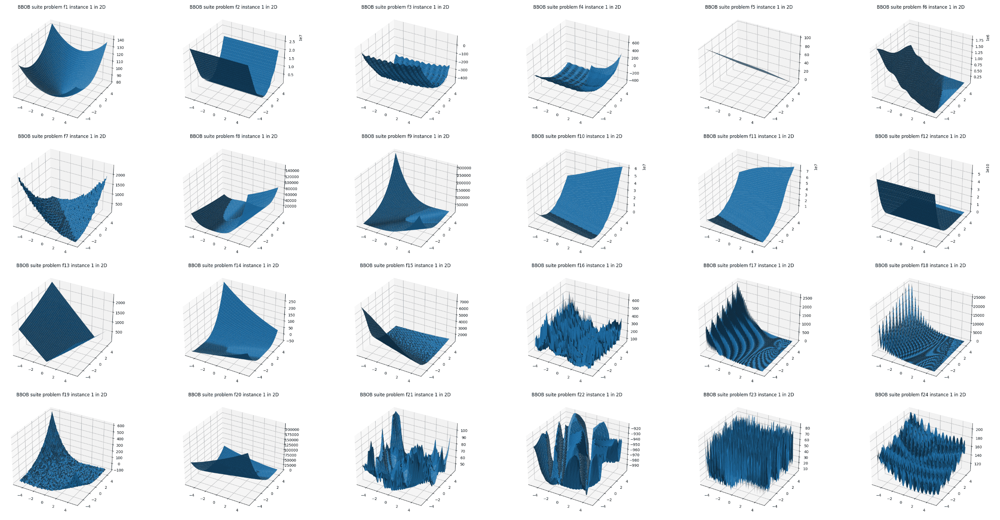

## Abstract

The blackbox optimization benchmarking (bbob) test suite comprises 24 noiseless single-objective test functions. BBOB is one of the most widely used test suites to evaluate and compare the performance of blackbox optimization algorithms. Each benchmark function is provided in dimensions \[2, 3, 5, 10, 20, 40\] with 15 instances.

## APIs

### class `Problem(function_id: int, dimension: int, instance_id: int = 1)`

- `function_id`: [ID of the bbob benchmark function](https://numbbo.github.io/coco/testsuites/bbob) to use. It must be in the range of `[1, 24]`.
- `dimension`: Dimension of the benchmark function. It must be in `[2, 3, 5, 10, 20, 40]`.
- `instance_id`: ID of the instance of the benchmark function. It must be in the range of `[1, 110]`.

#### Methods and Properties

- `search_space`: Return the search space.
  - Return type: `dict[str, optuna.distributions.BaseDistribution]`
- `direction`: Return the optimization direction.
  - Return type: `optuna.study.StudyDirection`
- `evaluate(params: dict[str, float])`: Evaluate the objective function.
  - Parameters:
    - `params`: Decision variable like `{"x0": x1_value, "x1": x1_value, ..., "xn": xn_value}`. The number of parameters must be equal to `dimension`.
  - Return type: `float`
- `coco_problem`: Return the COCO problem instance.
  - Return type: `cocoex.Problem`

It is also available that properties defiend in [cocoex.Problem](https://numbbo.github.io/coco-doc/apidocs/cocoex/cocoex.Problem.html) such as `number_of_objectives`.

## Installation

Please install the [coco-experiment](https://github.com/numbbo/coco-experiment/tree/main/build/python) package.

```shell
pip install -U coco-experiment
```

## Example

```python
import optuna
import optunahub


bbob = optunahub.load_module("benchmarks/bbob")
sphere2d = bbob.Problem(function_id=1, dimension=2, instance_id=1)

study = optuna.create_study(direction=sphere2d.direction)
study.optimize(sphere2d, n_trials=20)

print(study.best_trial.params, study.best_trial.value)
```

## List of Benchmark Functions

Please refer to [the paper](https://numbbo.github.io/gforge/downloads/download16.00/bbobdocfunctions.pdf) for details about each benchmark function.

**Category**

1. Separable Functions
1. Functions with low or moderate conditioning
1. Functions with high conditioning and unimodal
1. Multi-modal functions with adequate global structure
1. Multi-modal functions with weak global structure

| Category  | Function ID | Function Name                                            |
|-----------|-------------|----------------------------------------------------------|
| 1         | 1           | Sphere Function                                          |
| 1         | 2           | Separable Ellipsoidal Function                           |
| 1         | 3           | Rastrigin Function                                       |
| 1         | 4           | Büche-Rastrigin Function                                 |
| 1         | 5           | Linear Slope                                             |
| 2         | 6           | Attractive Sector Function                               |
| 2         | 7           | Step Ellipsoidal Function                                |
| 2         | 8           | Rosenbrock Function, original                            |
| 2         | 9           | Rosenbrock Function, rotated                             |
| 3         | 10          | Ellipsoidal Function                                     |
| 3         | 11          | Discus Function                                          |
| 3         | 12          | Bent Cigar Function                                      |
| 3         | 13          | Sharp Ridge Function                                     |
| 3         | 14          | Different Powers Function                                |
| 4         | 15          | Rastrigin Function                                       |
| 4         | 16          | Weierstrass Function                                     |
| 4         | 17          | Schaffer's F7 Function                                   |
| 4         | 18          | Schaffer's F7 Function, moderately ill-conditioned       |
| 4         | 19          | Composite Griewank-Rosenbrock Function F8F2              |
| 5         | 20          | Schwefel Function                                        |
| 5         | 21          | Gallagher's Gaussian 101-me Peaks Function               |
| 5         | 22          | Gallagher's Gaussian 21-hi Peaks Function                |
| 5         | 23          | Katsuura Function                                        |
| 5         | 24          | Lunacek bi-Rastrigin Function                            |



## Reference

Finck, S., Hansen, N., Ros, R., & Auger, A. [Real-Parameter Black-Box Optimization Benchmarking 2009: Presentation of the Noiseless Functions](https://numbbo.github.io/gforge/downloads/download16.00/bbobdocfunctions.pdf).
