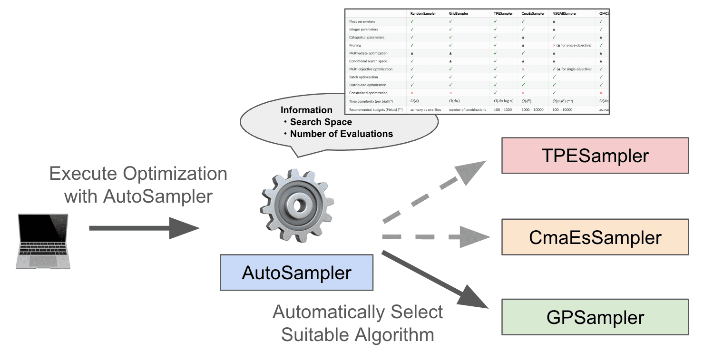

## Abstract

This package automatically selects an appropriate sampler for the provided search space based on the developers' recommendation. The following article provides detailed information about AutoSampler.

- 📰 [AutoSampler: Automatic Selection of Optimization Algorithms in Optuna](https://medium.com/optuna/autosampler-automatic-selection-of-optimization-algorithms-in-optuna-1443875fd8f9)



## Class or Function Names

- AutoSampler

This sampler currently accepts only `seed` and `constraints_func`.
`constraints_func` enables users to handle constraints along with the objective function.
These arguments follow the same convention as the other samplers, so please take a look at [the reference](https://optuna.readthedocs.io/en/stable/reference/samplers/generated/optuna.samplers.TPESampler.html).

## Installation

This sampler requires optional dependencies of Optuna.

```shell
$ pip install optunahub cmaes torch scipy
```

Note that since we may update the implementation of `AutoSampler`, it is highly encouraged to use the latest version of Optuna.

## Example

```python
import optuna
import optunahub


def objective(trial):
  x = trial.suggest_float("x", -5, 5)
  y = trial.suggest_float("y", -5, 5)
  return x**2 + y**2


module = optunahub.load_module(package="samplers/auto_sampler")
study = optuna.create_study(sampler=module.AutoSampler())
study.optimize(objective, n_trials=300)
```

### Test

To execute the tests for `AutoSampler`, please run the following commands. The test file is provided in the package.

```sh
pip install pytest
```

```python
pytest package/samplers/auto_sampler/tests/
```
